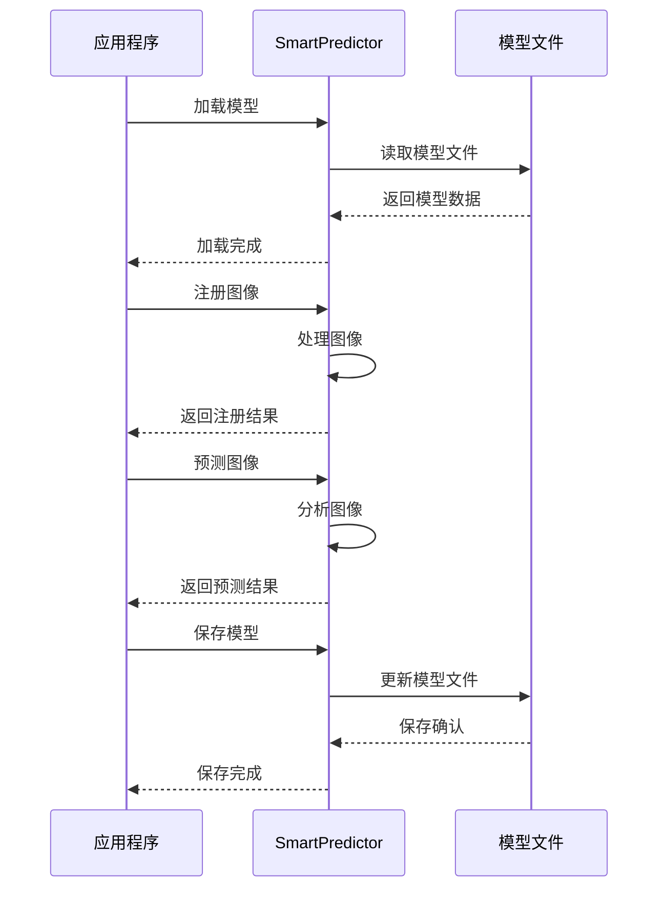

# API 概述

SmartPredictor 提供了一组简单易用的 C++ 接口，用于图像识别系统的核心功能。

## 核心接口

### 1. 模型加载
```cpp
int SmartPredictor_load(const std::string& model_dir)
```
- 功能：加载模型文件
- 参数：model_dir - 模型文件目录路径
- 返回：0表示成功，非0表示失败

### 2. 图像注册
```cpp
int SmartPredictor_regist_img(unsigned char* img_bytes, long file_size, std::string label)
```
- 功能：注册新的图像样本
- 参数：
  - img_bytes: 图像数据
  - file_size: 图像大小
  - label: 图像标签
- 返回：注册成功返回样本ID，失败返回负数

### 3. 图像预测
```cpp
std::string SmartPredictor_predict_img_filter(unsigned char* img_bytes, unsigned int file_size, float filter_sim)
```
- 功能：预测图像类别
- 参数：
  - img_bytes: 图像数据
  - file_size: 图像大小
  - filter_sim: 相似度过滤阈值
- 返回：预测结果字符串

### 4. 模型保存
```cpp
int SmartPredictor_save(std::string model_dir)
```
- 功能：保存模型更新
- 参数：model_dir - 模型保存目录
- 返回：1表示成功，其他值表示失败

## 使用流程



## 错误码说明

| 错误码 | 说明 |
|--------|------|
| 0 | 成功 |
| -1 | 模型加载失败 |
| -2 | 图像注册失败 |
| -3 | 预测失败 |
| -4 | 保存失败 |

## 最佳实践

1. 模型加载
   - 在应用启动时加载模型
   - 确保模型文件路径正确
   - 检查加载返回值

2. 图像注册
   - 确保图像格式正确
   - 使用有意义的标签
   - 定期清理不需要的样本

3. 图像预测
   - 设置合适的相似度阈值（建议0.5-0.8）
   - 处理预测失败的情况
   - 考虑批量预测的性能优化

4. 模型保存
   - 定期保存模型更新
   - 在应用退出前保存
   - 检查保存结果

## 性能优化

1. 批量处理
   - 批量注册图像
   - 批量预测图像
   - 减少模型加载/保存次数

2. 内存管理
   - 及时释放不需要的图像数据
   - 避免频繁的内存分配
   - 使用内存池优化

3. 多线程处理
   - 使用线程池处理图像
   - 避免线程间的资源竞争
   - 合理设置线程数量 