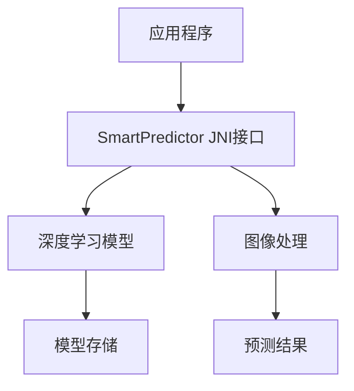

# SmartPredictor 图像识别系统

SmartPredictor 是一个基于深度学习的图像识别系统，支持图像注册和预测功能。系统提供了简单易用的 C++ 接口，可以方便地集成到各种应用中。

## 主要特性

- 🚀 简单易用的 API 接口
- 📸 支持图像注册和预测
- 🎯 高精度的识别结果
- 🔄 支持模型在线更新
- 📊 可配置的相似度阈值
- 💾 模型持久化存储

## 快速开始

```cpp
// 1. 加载模型
std::string model_dir = "path/to/model";
int result = SmartPredictor_load(model_dir);

// 2. 注册图像
std::string label = "apple";
result = SmartPredictor_regist_img(img_bytes, img_size, label);

// 3. 预测图像
std::string prediction = SmartPredictor_predict_img_filter(img_bytes, img_size, 0.6);
```

## 系统架构



## 文档导航

- [快速开始](getting-started/quickstart.md) - 快速上手指南
- [安装说明](getting-started/installation.md) - 详细的安装步骤
- [API文档](api/overview.md) - 完整的API参考
- [示例代码](examples/basic.md) - 使用示例
- [常见问题](faq.md) - 常见问题解答

## 支持与反馈

如果您在使用过程中遇到任何问题，或有任何建议，请通过以下方式联系我们：

- 提交 [GitHub Issue](https://github.com/RonssonAi/fresh_recognition/issues)
- 访问项目主页：[https://github.com/RonssonAi/fresh_recognition](https://github.com/RonssonAi/fresh_recognition)

## 许可证

本项目采用 [MIT 许可证](LICENSE)。 