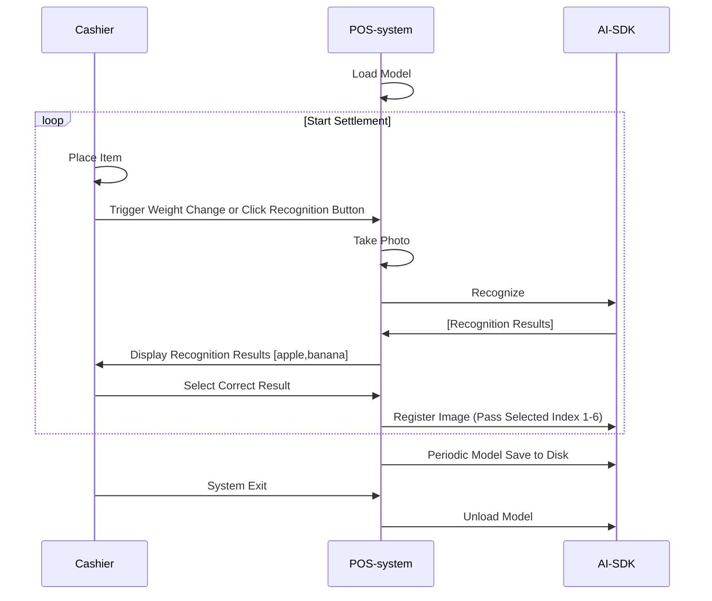

# Ronsson AI SDK Document

# Table of Contents | 目录

- [Overview | 概述](#overview--概述)
- [System Requirements | 系统要求](#system-requirements--系统要求)
- [Notice | 注意事项](#notice--注意事项)
- [Usage Flow | 使用流程](#usage-flow--使用流程)
- [File Structure | 文件结构](#file-structure--文件结构)
- [Core APIs | 核心API](#core-apis--核心api)
- [Getting Started | 开始使用](#getting-started--开始使用)
- [Common Tasks | 常见任务](#common-tasks--常见任务)
- [Support | 支持](#support--支持)

## Overview | 概述

Ronsson AI SDK provides APIs for AI fresh food image classification.
Ronsson AI SDK 提供用于AI生鲜食品图像分类的API接口。

## System Requirements | 系统要求

- Linux
  - Support x64 CPU architecture
  - Tested on Debian series (11.11.0, 12.11.0, etc.)
  - Requires C++11 support

## Notice | 注意事项

One authorization code can only be used on one terminal, please contact us to obtain authorization code (chenbuqiao@qq.com)
一个授权码只能在一台终端上使用，请联系我们获取授权码 (chenbuqiao@qq.com)

## Usage Flow | 使用流程

- The following diagram shows the simple workflow of the SDK:
- 下图展示了SDK的简单工作流程：

  ```mermaid
  flowchart TD
      A[Start] --> L[Load Model]
      L --> P[Predict]
      P --> R[Register]
      R --> U[Unload Model]
      U --> Z[End]
  ```
- System Integration Best Practices:
- 系统集成最佳实践：



## File Structure | 文件结构

1. `demo` - Contains both the activation tool and example program
   `demo` - 包含激活工具和示例程序
2. `lib/` - all library, `smart_predictor_jni.so` - Core SDK library
   `lib/` - 所有库文件，`smart_predictor_jni.so` - 核心SDK库
3. `model/` - Directory for AI algorithm model files
   `model/` - AI算法模型文件目录
4. `docs/` - Documentation files
   `docs/` - 文档文件

### Core APIs | 核心API

- [SDK Authorization | SDK授权](apis/authorization.md)
  - Authorize SDK usage with validation codes
  - 使用验证码授权SDK使用
- [Model Loading | 模型加载](apis/model_load.md)
  - Load AI models into memory
  - 将AI模型加载到内存中
- [Image Prediction | 图像预测](apis/prediction.md)
  - Classify images using loaded models
  - 使用加载的模型对图像进行分类
- [Image Registration | 图像注册](apis/registration.md)
  - Add training data to improve model accuracy
  - 添加训练数据以提高模型准确性
- [Model Management | 模型管理](apis/model_management.md)
  - Save, reset, and manage model data
  - 保存、重置和管理模型数据
- [Model Export | 导出模型](apis/model_export.md)
  - Export model
  - 导出模型
- [Model Import | 导入模型](apis/model_import.md)
  - Import model
  - 导入模型

## Getting Started | 开始使用

### Installation | 安装

1. Download the SDK package
   下载SDK包
2. Extract the files to your project directory
   将文件解压到您的项目目录

### Code Integration | 代码集成

1. Initialize the SDK | 初始化SDK:

```cpp
// Configuration parameters
const char* LIB_NAME = "./lib/libsmart_predictor_jni.so";
const char* MODEL_DIR = "./model";
const char* TEST_IMAGE_PATH = "demo.jpg";
const char* EXPORT_DIR = "./export";
float PREDICTION_THRESHOLD = 0.3f;

// Function pointers
void* lib_handle = nullptr;
using SmartPredictor_load = int(*)(const char*, int);
using SmartPredictor_unload = int(*)();
using SmartPredictor_predict_img = int(*)(unsigned char*, long, float, char*, long);
using SmartPredictor_regist_img = int(*)(unsigned char*, long, const char*, int);
using SmartPredictor_save = int(*)(const char*);
using SmartPredictor_reset = bool(*)(const char*);
using SmartPredictor_delete = bool(*)(const char*);
using SmartPredictor_sign = int(*)(const char*, const char*);
using SmartPredictor_export_model = int(*)(const char*, const char*, int);
using SmartPredictor_import_model = int(*)(const char*, const char*);

SmartPredictor_load load_func = nullptr;
SmartPredictor_unload unload_func = nullptr;
SmartPredictor_predict_img predict_func = nullptr;
SmartPredictor_regist_img regist_func = nullptr;
SmartPredictor_save save_func = nullptr;
SmartPredictor_reset reset_func = nullptr;
SmartPredictor_delete delete_func = nullptr;
SmartPredictor_sign sign_func = nullptr;
SmartPredictor_export_model export_func = nullptr;
SmartPredictor_import_model import_func = nullptr;

lib_handle = dlopen(LIB_NAME, RTLD_LAZY);

load_func = (SmartPredictor_load)dlsym(lib_handle, "SmartPredictor_load");
unload_func = (SmartPredictor_unload)dlsym(lib_handle, "SmartPredictor_unload");
predict_func = (SmartPredictor_predict_img)dlsym(lib_handle, "SmartPredictor_predict_img");
regist_func = (SmartPredictor_regist_img)dlsym(lib_handle, "SmartPredictor_regist_img");
save_func = (SmartPredictor_save)dlsym(lib_handle, "SmartPredictor_save");
reset_func = (SmartPredictor_reset)dlsym(lib_handle, "SmartPredictor_reset");
delete_func = (SmartPredictor_delete)dlsym(lib_handle, "SmartPredictor_delete");
sign_func = (SmartPredictor_sign)dlsym(lib_handle, "SmartPredictor_sign");
export_func = (SmartPredictor_export_model)dlsym(lib_handle, "SmartPredictor_export_model");
import_func = (SmartPredictor_import_model)dlsym(lib_handle, "SmartPredictor_import_model");
```

2. Load model | 加载模型:

```cpp
// Load the model
if (load_func(MODEL_DIR, 2) < 0) {
    std::cout << "Failed to load model" << std::endl;
} else {
    std::cout << "Model loaded successfully" << std::endl;
}
```

3. Perform your first prediction | 执行首次预测:

```cpp
std::vector<unsigned char> imageData = readImage(TEST_IMAGE_PATH);
char buffer[1024];
int predictResult = predict_func(imageData.data(),
                                 static_cast<unsigned int>(imageData.size()), 
                                 PREDICTION_THRESHOLD,
                                 buffer,
                                 sizeof(buffer));
std::cout << "Prediction result: " << predictResult << std::endl;
std::cout << "Prediction content: " << buffer << std::endl;             
```

4. Registering New Images | 注册新图像

```cpp
std::vector<unsigned char> imageData = readImage(TEST_IMAGE_PATH);
auto start = std::chrono::high_resolution_clock::now();

int registResult = regist_func(imageData.data(), 
                               static_cast<unsigned int>(imageData.size()), 
                               label.c_str(), 6);

auto end = std::chrono::high_resolution_clock::now();
auto duration = std::chrono::duration_cast<std::chrono::milliseconds>(end - start);

std::cout << "Registration time: " << duration.count() << "ms" << std::endl;
std::cout << "Registration result: " << registResult << std::endl;
```

5. Clean up | 清理:

```cpp
if (unload_func() == 0) {
    std::cout << "Model unloaded successfully" << std::endl;
} else {
    std::cout << "Failed to unload model" << std::endl;
}
```

## Common Tasks | 常见任务

### Save the model to disk | 保存模型到磁盘

```cpp
// Save the model to disk, recommended to call every 5 minutes or after accumulating 30 registered images
// 保存模型到磁盘，建议每5分钟调用一次或在累积30张注册图像后调用
if (save_func(MODEL_DIR) != 1) {
    std::cout << "Failed to save model" << std::endl;
} else {
    std::cout << "Model saved successfully" << std::endl;
}
```

### Delete Labels | 删除标签

```cpp
// Delete a label and all images in sdk
// 删除SDK中的标签和所有相关图像
if (delete_func(label_to_delete.c_str())) {
    std::cout << "Label deleted successfully" << std::endl;
} else {
    std::cout << "Failed to delete label" << std::endl;
}
```

### Reset the Model | 重置模型

```cpp
// Reset the model (irreversible)
// 重置模型（不可逆操作）
if (reset_func(MODEL_DIR)) {
    std::cout << "Model cleared successfully" << std::endl;
} else {
    std::cout << "Failed to clear model" << std::endl;
}
```

### Export the Model | 导出模型

```
// Export the model
// 导出模型
if (export_func(MODEL_DIR, EXPORT_DIR, 2)) {
    std::cout << "Model export successfully" << std::endl;
} else {
    std::cout << "Failed to export model" << std::endl;
}
```

### Import the Model | 导入模型

```
// Import the model
// 导入模型
if (import_func(MODEL_DIR, EXPORT_DIR)) {
    std::cout << "Model import successfully" << std::endl;
} else {
    std::cout << "Failed to import model" << std::endl;
}
```


## Support | 支持

For technical support or questions | 如需技术支持或有任何问题：

- Email: chenbuqiao@rongxwy.com
- wechat: chenbuqiao
