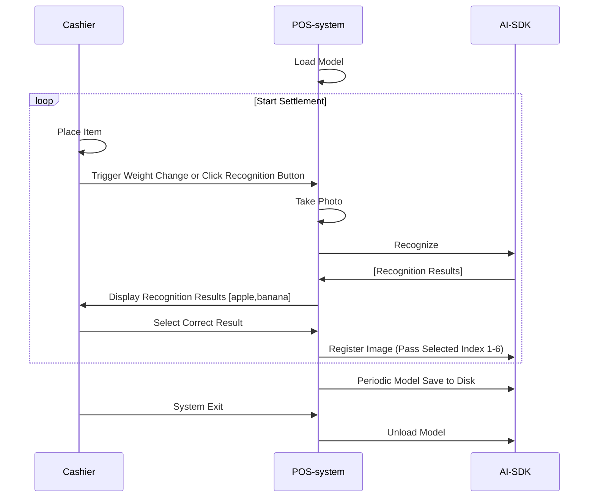

# Ronsson AI SDK Documentation

## Table of Contents

- [Overview](#overview)
- [System Requirements](#system-requirements)
- [Notice](#notice)
- [Usage Flow](#usage-flow)
- [File Structure](#file-structure)
- [Core APIs](#core-apis)
- [Getting Started](#getting-started)
- [Common Tasks](#common-tasks)
- [Support](#support)

## Overview

Ronsson AI SDK provides APIs for AI fresh food image classification.

## System Requirements

- Windows operating system
- C++ development environment
- Minimum 4GB RAM
- 1GB free disk space
- Supports x64 or x86 CPU architecture

## Notice

One authorization code can only be used on one terminal, please contact us to obtain authorization code (chenbuqiao@qq.com)


## Usage Flow

- The following diagram shows the simple workflow of the SDK:

    ```mermaid
    flowchart TD
        A[Start] --> L[Load Model]
        L --> P[Predict]
        P --> R[Register]
        R --> U[Unload Model]
        U --> Z[End]
    ```

- System Integration Best Practices:




## File Structure

1. `demo.exe` - Contains both the activation tool and example program
2. `lib/` - all library, `smart_predictor_jni.dll` - Core SDK library
3. `model/` - Directory for AI algorithm model files
4. `docs/` - Documentation files


### Core APIs
- [SDK Authorization](apis/authorization.md) - Authorize SDK usage with validation codes
- [Model Loading](apis/model_load.md) - Load AI models into memory
- [Image Prediction](apis/prediction.md) - Classify images using loaded models
- [Image Registration](apis/registration.md) - Add training data to improve model accuracy
- [Model Management](apis/model_management.md) - Save, reset, and manage model data


## Getting Started

### Installation

1. Download the SDK package
2. Extract the files to your project directory


### Code Integration

1. Initialize the SDK:
```cpp

SetDllDirectoryW(L"lib");

// Configuration parameters
const wchar_t* DLL_NAME = L"smart_predictor_jni.dll";
const char* MODEL_DIR = "./model";
const char* TEST_IMAGE_PATH = "demo.jpg";
float PREDICTION_THRESHOLD = 0.3f;

// DLL function pointers
HINSTANCE dll_handle = nullptr;
using SmartPredictor_load = int(CALLBACK*)(const std::string&, int);
using SmartPredictor_unload = int(CALLBACK*)();
using SmartPredictor_predict_img_filter = std::string(CALLBACK*)(unsigned char*, long, float);
using SmartPredictor_regist_img = int(CALLBACK*)(unsigned char*, long byte_size, std::string label, int pos);
using SmartPredictor_save = int(CALLBACK*)(const std::string);
using SmartPredictor_reset = bool(CALLBACK*)(const std::string);
using SmartPredictor_delete = bool(CALLBACK*)(const std::string);
using SmartPredictor_sign = int(CALLBACK*)(const std::string, const std::string);

// Function pointers
SmartPredictor_load load_func = nullptr;
SmartPredictor_unload unload_func = nullptr;
SmartPredictor_predict_img_filter predict_func = nullptr;
SmartPredictor_regist_img regist_func = nullptr;
SmartPredictor_save save_func = nullptr;
SmartPredictor_reset reset_func = nullptr;
SmartPredictor_delete delete_func = nullptr;
SmartPredictor_sign sign_func = nullptr;

dll_handle = LoadLibraryW(DLL_NAME);

load_func = (SmartPredictor_load)GetProcAddress(dll_handle, "SmartPredictor_load");
unload_func = (SmartPredictor_unload)GetProcAddress(dll_handle, "SmartPredictor_unload");
predict_func = (SmartPredictor_predict_img_filter)GetProcAddress(dll_handle, "SmartPredictor_predict_img_filter");
regist_func = (SmartPredictor_regist_img)GetProcAddress(dll_handle, "SmartPredictor_regist_img");
save_func = (SmartPredictor_save)GetProcAddress(dll_handle, "SmartPredictor_save");
reset_func = (SmartPredictor_reset)GetProcAddress(dll_handle, "SmartPredictor_reset");
delete_func = (SmartPredictor_delete)GetProcAddress(dll_handle, "SmartPredictor_delete");
sign_func = (SmartPredictor_sign)GetProcAddress(dll_handle, "SmartPredictor_sign");

```

2. Load model:
```cpp

// Load the model
int modelHandle = SmartPredictor_load("./model", 4);
if (modelHandle < 0) {
    std::cerr << "Failed to load model" << std::endl;
    return;
}
```

3. Perform your first prediction:
```cpp
// Read an image
std::vector<unsigned char> imageData = readImage("demo.jpg");

// Predict
std::string result = SmartPredictor_predict_img_filter(
    imageData.data(),
    imageData.size(),
    0.3f
);

// Display results
std::cout << "Prediction results: " << result << std::endl;
```

4.Registering New Images

```cpp
// Read an image
std::vector<unsigned char> imageData = readImage("demo.jpg");
// Register a new image
int result = SmartPredictor_regist_img(
    imageData.data(),
    imageData.size(),
    "apple",
    6
);
```

4. Clean up:
```cpp
// Release resources
SmartPredictor_unload();
```

## Common Tasks

### Save the model to disk
```cpp
// Save the model to disk, recommended to call every 5 minutes or after accumulating 30 registered images
SmartPredictor_save("./model");
```

### Delete Labels

```cpp
// Delete a label and all images in sdk
if (SmartPredictor_delete("apple")) {
    std::cout << "Label deleted successfully" << std::endl;
}
```

### Reset the Model

```cpp
// Reset the model (irreversible)
if (SmartPredictor_reset("./model")) {
    std::cout << "Model reset successfully" << std::endl;
}
```

## Support

For technical support or questions:
- Email: chenbuqiao@rongxwy.com
- wechat: chenbuqiao 