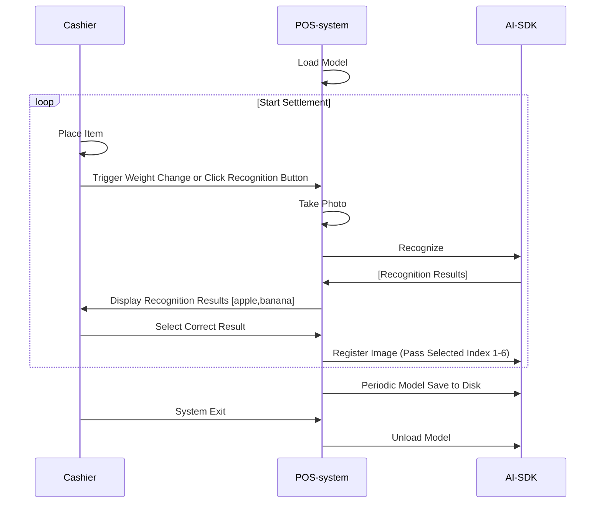

# Ronsson AI SDK Document

# Table of Contents | 目录

- [Overview | 概述](#overview--概述)
- [System Requirements | 系统要求](#system-requirements--系统要求)
- [Notice | 注意事项](#notice--注意事项)
- [Usage Flow | 使用流程](#usage-flow--使用流程)
- [File Structure | 文件结构](#file-structure--文件结构)
- [Core APIs | 核心API](#core-apis--核心api)
- [Getting Started | 开始使用](#getting-started--开始使用)
- [Common Tasks | 常见任务](#common-tasks--常见任务)
- [Support | 支持](#support--支持)

## Overview | 概述

Ronsson AI SDK provides APIs for AI fresh food image classification.
Ronsson AI SDK 提供用于AI生鲜食品图像分类的API接口。

## System Requirements | 系统要求

- Windows
  - Supports x64 or x86 CPU architecture| 支持x64或x86 CPU架构
- Linux
  - Support x64 CPU architecture
  - Tested on Ubuntu series (20.04, 22.04, etc.)
  - Requires C++11 support

## Notice | 注意事项

One authorization code can only be used on one terminal, please contact us to obtain authorization code (chenbuqiao@qq.com)
一个授权码只能在一台终端上使用，请联系我们获取授权码 (chenbuqiao@qq.com)

## Usage Flow | 使用流程

- The following diagram shows the simple workflow of the SDK:
- 下图展示了SDK的简单工作流程：

  ```mermaid
  flowchart TD
      A[Start] --> L[Load Model]
      L --> P[Predict]
      P --> R[Register]
      R --> U[Unload Model]
      U --> Z[End]
  ```
- System Integration Best Practices:
- 系统集成最佳实践：



## File Structure | 文件结构

1. `demo.exe` - Contains both the activation tool and example program
   `demo.exe` - 包含激活工具和示例程序
2. `lib/` - all library, `smart_predictor_jni.dll` - Core SDK library
   `lib/` - 所有库文件，`smart_predictor_jni.dll` - 核心SDK库
3. `model/` - Directory for AI algorithm model files
   `model/` - AI算法模型文件目录
4. `docs/` - Documentation files
   `docs/` - 文档文件

### Core APIs | 核心API

- [SDK Authorization | SDK授权](apis/authorization.md)
  - Authorize SDK usage with validation codes
  - 使用验证码授权SDK使用
- [Model Loading | 模型加载](apis/model_load.md)
  - Load AI models into memory
  - 将AI模型加载到内存中
- [Image Prediction | 图像预测](apis/prediction.md)
  - Classify images using loaded models
  - 使用加载的模型对图像进行分类
- [Image Registration | 图像注册](apis/registration.md)
  - Add training data to improve model accuracy
  - 添加训练数据以提高模型准确性
- [Model Management | 模型管理](apis/model_management.md)
  - Save, reset, and manage model data
  - 保存、重置和管理模型数据

## Getting Started | 开始使用

### Installation | 安装

1. Download the SDK package
   下载SDK包
2. Extract the files to your project directory
   将文件解压到您的项目目录

### Code Integration | 代码集成

1. Initialize the SDK | 初始化SDK:

```cpp
SetDllDirectoryW(L"lib");

// Configuration parameters
const wchar_t* DLL_NAME = L"smart_predictor_jni.dll";
const char* MODEL_DIR = "./model";
const char* TEST_IMAGE_PATH = "demo.jpg";
float PREDICTION_THRESHOLD = 0.3f;

// DLL function pointers
HINSTANCE dll_handle = nullptr;
using SmartPredictor_load = int(CALLBACK*)(const char*, int);
using SmartPredictor_unload = int(CALLBACK*)();
using SmartPredictor_predict_img = int (CALLBACK*)(unsigned char*, long, float, char*, long);
using SmartPredictor_regist_img = int(CALLBACK*)(unsigned char*, long byte_size, const char* label, int pos);
using SmartPredictor_save = int(CALLBACK*)(const char*);
using SmartPredictor_reset = bool(CALLBACK*)(const char*);
using SmartPredictor_delete = bool(CALLBACK*)(const char*);
using SmartPredictor_sign = int(CALLBACK*)(const char*, const char*);

// Function pointers
SmartPredictor_load load_func = nullptr;
SmartPredictor_unload unload_func = nullptr;
SmartPredictor_predict_img predict_func = nullptr;
SmartPredictor_regist_img regist_func = nullptr;
SmartPredictor_save save_func = nullptr;
SmartPredictor_reset reset_func = nullptr;
SmartPredictor_delete delete_func = nullptr;
SmartPredictor_sign sign_func = nullptr;

dll_handle = LoadLibraryW(DLL_NAME);

load_func = (SmartPredictor_load)GetProcAddress(dll_handle, "SmartPredictor_load");
unload_func = (SmartPredictor_unload)GetProcAddress(dll_handle, "SmartPredictor_unload");
predict_func = (SmartPredictor_predict_img)GetProcAddress(dll_handle, "SmartPredictor_predict_img_filter");
regist_func = (SmartPredictor_regist_img)GetProcAddress(dll_handle, "SmartPredictor_regist_img");
save_func = (SmartPredictor_save)GetProcAddress(dll_handle, "SmartPredictor_save");
reset_func = (SmartPredictor_reset)GetProcAddress(dll_handle, "SmartPredictor_reset");
delete_func = (SmartPredictor_delete)GetProcAddress(dll_handle, "SmartPredictor_delete");
sign_func = (SmartPredictor_sign)GetProcAddress(dll_handle, "SmartPredictor_sign");
```

2. Load model | 加载模型:

```cpp
// Load the model
int result = SmartPredictor_load("./model", 4);
if (result < 0) {
    std::cerr << "Failed to load model" << std::endl;
    return;
} else {
    std::cout << "Model loaded successfully" << std::endl;
}
```

3. Perform your first prediction | 执行首次预测:

```cpp
// Read an image
std::vector<unsigned char> imageData = readImage("demo.jpg");

// Prepare buffer for results
char buffer[1024];

// Predict
int result = SmartPredictor_predict_img_filter(
    imageData.data(),
    static_cast<long>(imageData.size()),
    0.3f,
    buffer,
    sizeof(buffer)
);

if (result >= 0) {
    std::cout << "Prediction results: " << buffer << std::endl;
} else {
    std::cerr << "Prediction failed" << std::endl;
}
```

4. Registering New Images | 注册新图像

```cpp
// Read an image
std::vector<unsigned char> imageData = readImage("demo.jpg");
// Register a new image
int result = SmartPredictor_regist_img(
    imageData.data(),
    static_cast<long>(imageData.size()),
    "apple",
    6
);

if (result >= 0) {
    std::cout << "Registration successful" << std::endl;
} else {
    std::cerr << "Registration failed" << std::endl;
}
```

5. Clean up | 清理:

```cpp
// Release resources
SmartPredictor_unload();
```

## Common Tasks | 常见任务

### Save the model to disk | 保存模型到磁盘

```cpp
// Save the model to disk, recommended to call every 5 minutes or after accumulating 30 registered images
// 保存模型到磁盘，建议每5分钟调用一次或在累积30张注册图像后调用
SmartPredictor_save("./model");
```

### Delete Labels | 删除标签

```cpp
// Delete a label and all images in sdk
// 删除SDK中的标签和所有相关图像
if (SmartPredictor_delete("apple")) {
    std::cout << "Label deleted successfully" << std::endl;
}
```

### Reset the Model | 重置模型

```cpp
// Reset the model (irreversible)
// 重置模型（不可逆操作）
if (SmartPredictor_reset("./model")) {
    std::cout << "Model reset successfully" << std::endl;
}
```

## Support | 支持

For technical support or questions | 如需技术支持或有任何问题：

- Email: chenbuqiao@rongxwy.com
- wechat: chenbuqiao
